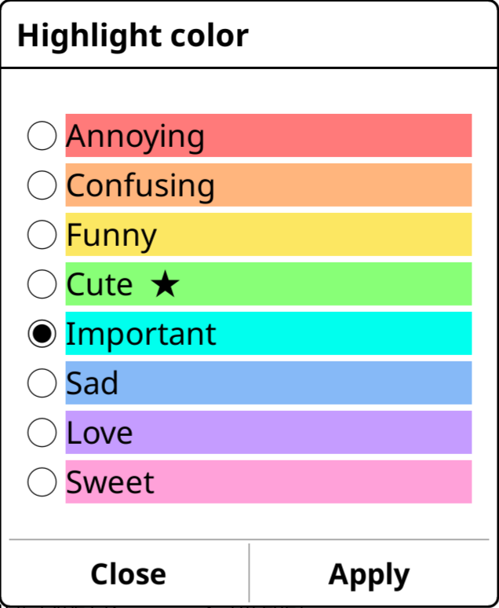
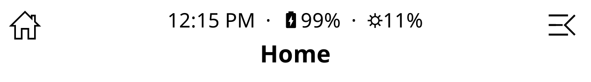
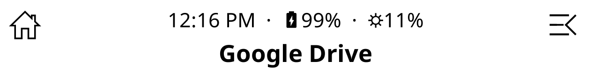
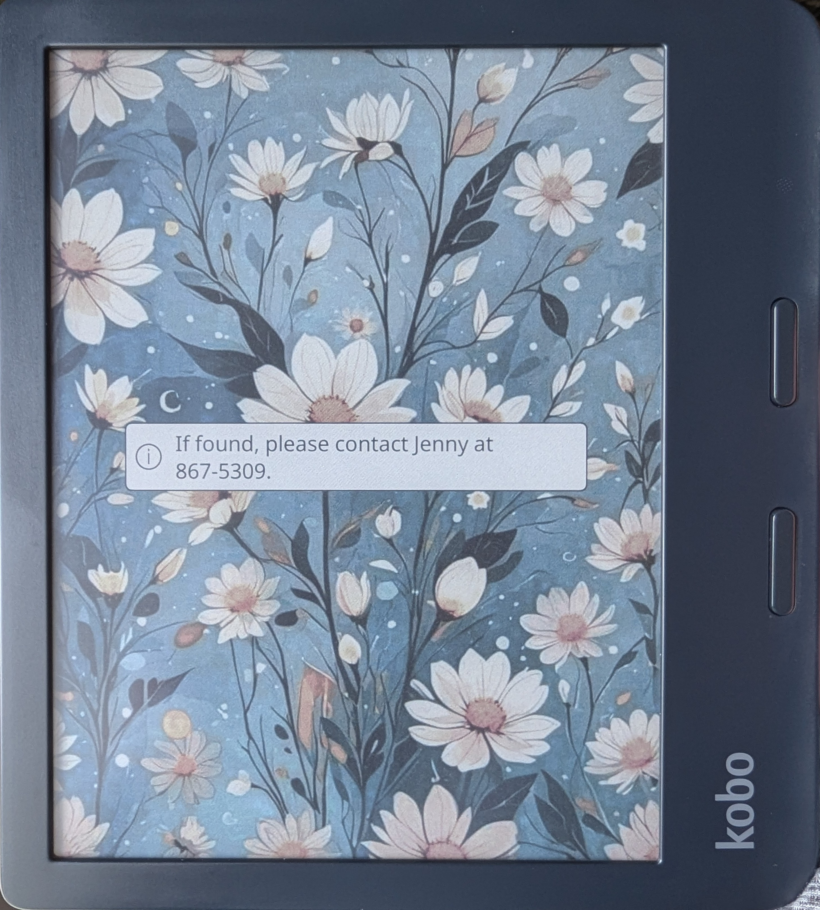

### [2-customize-highlight-colors](2-customize-highlight-colors.lua)
This patch allows you to customize your highlight colors.

### [2-large-subtitles](2-large-subtitles.lua)
This patch makes subtitles the same size as the title. This works well when using the [2-filemanager-titlebar patch](https://github.com/sebdelsol/KOReader.patches/tree/main#-2-filemanager-titlebar) by [sebdelsol](https://github.com/sebdelsol)

### [2-shortcut-subtitles](2-shortcut-subtitles.lua)
This patch replaces the filepath in the subtitle with the shortcut name when you open a shortcut folder.

### [2-modify-exit-sleep-screen-message](2-modify-exit-sleep-screen-message.lua)
This patch changes the text of the exit sleep screen message when you postpone screen update after wakeup (in sleep screen settings) until 'exit sleep screen' gesture that you set up with the gesture manager. If your device is lost and someone finds it, this can tell them how to contact you, and in the meantime, they won't know the gesture that will exit the sleep screen, or that it is even waiting for a gesture.

Hint: In the gesture manager, you can enable multiswipes for more complicated gestures, and can record your own custom multiswipe (you can't mix straight up/down with diagonal swipes). Recording seems more sucessful if you swipe quickly.

